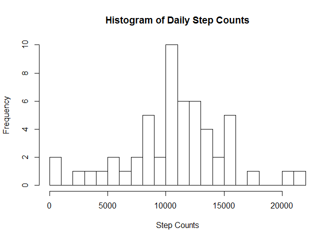
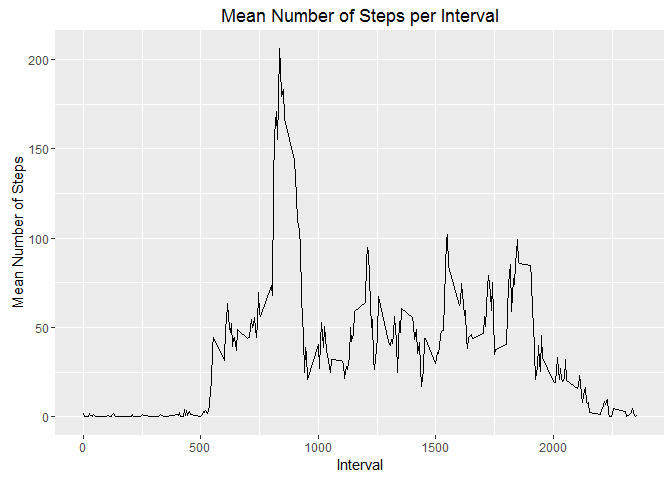
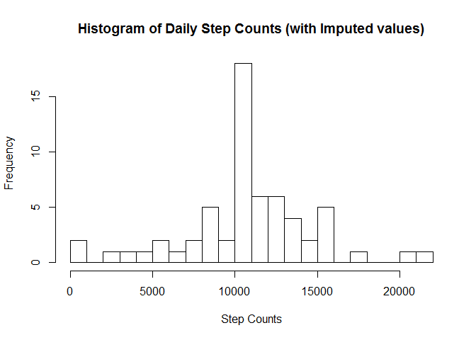
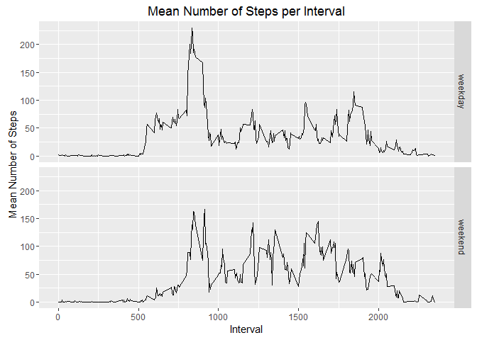
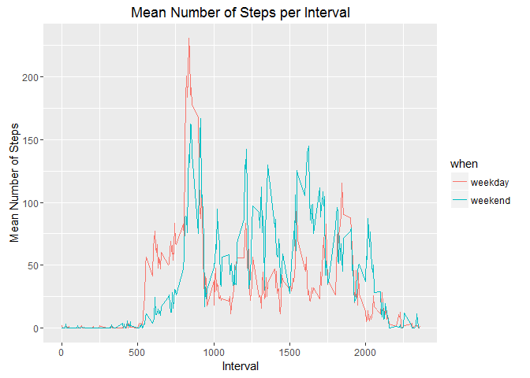

# Reproducible Research: Peer Assessment 1
Tom Cardozo  
March 16, 2016  


## Loading and preprocessing the data
To avoid clutter, the load libraries chunk does not display results or warnings.  At least, it was not supposed to.

```r
library(dplyr)
library(ggplot2)
```


```r
datafile <- 'activity.csv'
weekendDays <- c('Saturday', 'Sunday')

# Unzip datafile if it has not yet been done
if (!file.exists(datafile)) {
	unzip('activity.zip')
}
activityDF <- read.csv(datafile)
activityDF$date <- as.Date(activityDF$date, '%Y-%m-%d')

categorizeDay <- function(date) {
  ifelse(is.element(weekdays(date), weekendDays), "weekend", "weekday")
}
activityDF$day <- as.factor(categorizeDay(activityDF$date))
head(activityDF)	# Sanity Check
```

```
##   steps       date interval     day
## 1    NA 2012-10-01        0 weekday
## 2    NA 2012-10-01        5 weekday
## 3    NA 2012-10-01       10 weekday
## 4    NA 2012-10-01       15 weekday
## 5    NA 2012-10-01       20 weekday
## 6    NA 2012-10-01       25 weekday
```


## What is mean total number of steps taken per day?

```r
activityDF %>%	group_by(date) %>%
		summarise(daily_steps = sum(steps)) -> dailyDF
bins <- seq(0, 22000, 1000)
hist(dailyDF$daily_steps, breaks = bins, 
     main = "Histogram of Daily Step Counts",
     xlab = "Step Counts")
```



```r
summary(dailyDF$daily_steps)
```

```
##    Min. 1st Qu.  Median    Mean 3rd Qu.    Max.    NA's 
##      41    8841   10760   10770   13290   21190       8
```


## What is the average daily activity pattern?

```r
averageDays <-  activityDF %>%	group_by(interval) %>%
		            summarise(interval_mean = mean(steps, na.rm = TRUE))
#summary(averageDays$interval_mean)

averageDays %>%
    ggplot(aes(x = interval, y = interval_mean)) +
    geom_line() +
    ggtitle("Mean Number of Steps per Interval") +
    xlab("Interval") + ylab("Mean Number of Steps")
```



Determine the 5-minute interval,on average acrosss all days, with the maximum number of steps...

```r
averageDays[which.max(averageDays$interval_mean),]
```

```
## Source: local data frame [1 x 2]
## 
##   interval interval_mean
##      (int)         (dbl)
## 1      835      206.1698
```


## Imputing missing values
How many rows in  the dataset have NA values:

```r
nrow(activityDF[is.na(activityDF$steps),])
```

```
## [1] 2304
```

The missing values in the dataset will be replaced with the mean value for that 5 minute interval.  The new fixed dataset is named fixedDF.


```r
# Get the interval mean number of steps for the specified interval
#
interval_mean <- function(interval) {
	averageDays$interval_mean[averageDays$interval == interval]
}

fixedDF <- activityDF

# Note that column 1 is steps, column 3 is interval
#
#	Loop through data frame setting the number of steps
#	to the interval average where the steps is NA
#
for(i in 1:nrow(fixedDF)) {
	if (is.na(fixedDF[i, 1])) {
		fixedDF[i, 1] <- interval_mean(fixedDF[i, 3])
	}
}
head(fixedDF)	# Sanity Check
```

```
##       steps       date interval     day
## 1 1.7169811 2012-10-01        0 weekday
## 2 0.3396226 2012-10-01        5 weekday
## 3 0.1320755 2012-10-01       10 weekday
## 4 0.1509434 2012-10-01       15 weekday
## 5 0.0754717 2012-10-01       20 weekday
## 6 2.0943396 2012-10-01       25 weekday
```

```r
fixedDF %>%	group_by(date) %>%
		summarise(daily_steps = sum(steps)) -> dailyFixedDF
hist(dailyFixedDF$daily_steps, breaks = bins, 
     main = "Histogram of Daily Step Counts (with Imputed values)",
     xlab = "Step Counts")
```



```r
summary(dailyFixedDF$daily_steps)
```

```
##    Min. 1st Qu.  Median    Mean 3rd Qu.    Max. 
##      41    9819   10770   10770   12810   21190
```
Compare to the summary of original daily step counts.

```r
summary(dailyDF$daily_steps)
```

```
##    Min. 1st Qu.  Median    Mean 3rd Qu.    Max.    NA's 
##      41    8841   10760   10770   13290   21190       8
```

The mean daily step count did not change after imputing values (interval means) for the NA values.  This is because there were 8 full days of NA values and no other NAs.  So that created exactly 8 days of mean data.

The extra data did however cause changes in the median and quartile values.

## Are there differences in activity patterns between weekdays and weekends?

```r
averageWeekdays <-  fixedDF %>%
                filter(day == "weekday") %>%
                group_by(interval) %>% 
		            summarise(interval_mean = mean(steps, na.rm = TRUE))
averageWeekdays$when <- 'weekday'

averageWeekends <-  fixedDF %>%
                filter(day == "weekend") %>%
                group_by(interval) %>%
		            summarise(interval_mean = mean(steps, na.rm = TRUE))
averageWeekends$when <- 'weekend'

intervalsDF <- rbind(averageWeekdays, averageWeekends)
# str(intervalsDF)
# tail(intervalsDF)

intervalsDF %>%
    ggplot(aes(x = interval, y = interval_mean)) +
    geom_line() + facet_grid(when ~ .) +
    ggtitle("Mean Number of Steps per Interval") +
    xlab("Interval") + ylab("Mean Number of Steps")
```



Here is an alternate comparison graph.


```r
intervalsDF %>%
    ggplot(aes(x = interval, y = interval_mean)) +
    geom_line(aes(color = when)) +
    ggtitle("Mean Number of Steps per Interval") +
    xlab("Interval") + ylab("Mean Number of Steps")
```


